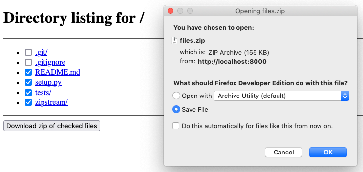

zipstream-ng
============
[](https://github.com/pR0Ps/zipstream-ng/actions/workflows/tests.yml)
[](https://pypi.org/project/zipstream-ng/)


A modern and easy to use streamable zip file generator. It can package and stream many files and
folders on the fly without needing temporary files or excessive memory.

Includes the ability to calculate the total size of the stream before any data is actually added
(provided no compression is used). This makes it ideal for use in web applications since the total
size can be used to set the `Content-Length` header without having to generate the entire file first
(see examples below).

Features:
 - Generates zip data on the fly as it's requested.
 - Can calculate the total size of the resulting zip file before generation even begins.
 - Flexible API: Typical use cases are simple, complicated ones are possible.
 - Supports zipping data from files, bytes, strings, and any other iterable objects.
 - Threadsafe: Won't mangle data if multiple threads concurrently add/read data to/from the same stream.
 - Includes a clone of Python's `http.server` module with zip support added. Try `python -m zipstream.server`.
 - Automatically uses Zip64 extensions, but only if they are required.
 - No external dependencies.


Installation
------------
```
pip install zipstream-ng
```


Examples
--------

### Create a local zip file (simple example)

Make an archive named `files.zip` in the current directory that contains all files under
`/path/to/files`.

```python
from zipstream import ZipStream

zs = ZipStream.from_path("/path/to/files/")

with open("files.zip", "wb") as f:
    f.writelines(zs)
```


### Create a local zip file (demos more of the API)

```python
from zipstream import ZipStream, ZIP_DEFLATED

# Create a ZipStream that uses the maximum level of Deflate compression.
zs = ZipStream(compress_type=ZIP_DEFLATED, compress_level=9)

# Set the zip file's comment.
zs.comment = "Contains compressed important files"

# Add all the files under a path.
# Will add all files under a top-level folder called "files" in the zip.
zs.add_path("/path/to/files/")

# Add another file (will be added as "data.txt" in the zip file).
zs.add_path("/path/to/file.txt", "data.txt")

# Add some random data from an iterable.
# This generator will only be run when the stream is generated.
def random_data():
    import random
    for _ in range(10):
        yield random.randbytes(1024)

zs.add(random_data(), "random.bin")

# Add a file containing some static text.
# Will automatically be encoded to bytes before being added (uses utf-8).
zs.add("This is some text", "README.txt")

# Write out the zip file as it's being generated.
# At this point the data in the files files will be read in and the generator
# will be iterated over.
with open("files.zip", "wb") as f:
    f.writelines(zs)
```


### zipserver (included)

A fully-functional and useful example can be found in the included
[`zipstream.server`](zipstream/server.py) module. It's a clone of Python's built in `http.server`
with the added ability to serve multiple files and folders as a single zip file. Try it out by
installing the package and running `zipserver --help` or `python -m zipstream.server --help`.




### Integration with a Flask webapp

A very basic [Flask](https://flask.palletsprojects.com/)-based file server that streams all the
files under the requested path to the client as a zip file. It also provides the total size of the
stream in the `Content-Length` header so the client can show a progress bar as the stream is
downloaded.

Note that while this example works, it's not a good idea to deploy it as-is due to the lack of input
validation and other security checks.

```python
import os.path
from flask import Flask, Response
from zipstream import ZipStream

app = Flask(__name__)

@app.route('/<path:path>', methods=['GET'])
def stream_zip(path):
    name = os.path.basename(os.path.normpath(path))
    zs = ZipStream.from_path(path)
    return Response(
        zs,
        mimetype="application/zip",
        headers={
            "Content-Disposition": f"attachment; filename={name}.zip",
            "Content-Length": len(zs),
        }
    )

if __name__ == "__main__":
    app.run(host='0.0.0.0', port=5000)
```


### Partial generation and last-minute file additions

It's possible to generate the zip stream, but stop before finalizing it. This enables adding
something like a file manifest or compression log after all the files have been added.

`ZipStream` provides a `get_info` method that returns information on all the files that have been
added to the stream. In this example, all that information will be added to the zip in a file named
"manifest.json" before finalizing it.

```python
from zipstream import ZipStream
import json

def gen_zipfile()
    zs = ZipStream.from_path("/path/to/files")
    yield from zs.all_files()
    zs.add(
        json.dumps(
            zs.get_info(),
            indent=2
        ),
        "manifest.json"
    )
    yield from zs.finalize()
```


Comparison to stdlib
--------------------
Since Python 3.6 it has actually been possible to generate zip files as a stream using just the
standard library, it just hasn't been very ergonomic or efficient. Consider the typical use case of
zipping up a directory of files while streaming it over a network connection:

(note that the size of the stream is not pre-calculated in this case as this would make the stdlib
example way too long).

Using ZipStream:
```python
from zipstream import ZipStream

send_stream(
    ZipStream.from_path("/path/to/files/")
)
```

<details>
<summary>The same(ish) functionality using just the stdlib:</summary>

```python
import os
import io
from zipfile import ZipFile, ZipInfo

class Stream(io.RawIOBase):
    """An unseekable stream for the ZipFile to write to"""

    def __init__(self):
        self._buffer = bytearray()
        self._closed = False

    def close(self):
        self._closed = True

    def write(self, b):
        if self._closed:
            raise ValueError("Can't write to a closed stream")
        self._buffer += b
        return len(b)

    def readall(self):
        chunk = bytes(self._buffer)
        self._buffer.clear()
        return chunk

def iter_files(path):
    for dirpath, _, files in os.walk(path, followlinks=True):
        if not files:
            yield dirpath  # Preserve empty directories
        for f in files:
            yield os.path.join(dirpath, f)

def read_file(path):
    with open(path, 'rb') as fp:
        while True:
            buf = fp.read(1024 * 64)
            if not buf:
                break
            yield buf

def generate_zipstream(path):
    stream = Stream()
    with ZipFile(stream, mode='w') as zf:
        toplevel = os.path.basename(os.path.normpath(path))
        for f in iter_files(path):
            # Use the basename of the path to set the arcname
            arcname = os.path.join(toplevel, os.path.relpath(f, path))
            zinfo = ZipInfo.from_file(f, arcname)

            # Write data to the zip file then yield the stream content
            with zf.open(zinfo, mode='w') as fp:
                if zinfo.is_dir():
                    continue
                for buf in read_file(f):
                    fp.write(buf)
                    yield stream.readall()
    yield stream.readall()

send_stream(
    generate_zipstream("/path/to/files/")
)
```
</details>


Tests
-----
This package contains extensive tests. To run them, install `pytest` (`pip install pytest`) and run
`py.test` in the project directory.


License
-------
Licensed under the [GNU LGPLv3](https://www.gnu.org/licenses/lgpl-3.0.html).
